<!-- Versão Motion · front-end, visual e animada -->

## Projetos

Clique em um card para abrir o projeto.

  
  

  
  

Código: <a href="https://github.com/Synndm/busca-pokemons">busca-pokemons</a> · <a href="https://github.com/Synndm/restaurante-interface">restaurante-interface</a> · <a href="https://github.com/Synndm/buscar-endereco">buscar-endereco</a> · <a href="https://github.com/Synndm/aniversario_synndm">aniversario_synndm</a>

## Metas 2026

<b>Mais sobre mim</b> (clique para abrir)

 

- Curso **Gestão da Tecnologia da Informação** na Uniasselvi (2027) e **Full Stack Java** na EBAC
- Gosto de entender o problema do cliente antes de escrever a primeira linha de código
- Também atuo com manutenção de computadores, então sei lidar com usuário de verdade
- Combustível: café e documentação aberta em 10 abas

<b>Estatísticas do GitHub</b> (clique para abrir)

 

## Vamos conversar?

Tem um projeto, uma vaga ou só quer trocar ideia sobre front-end? Me chama!

  
  
  

